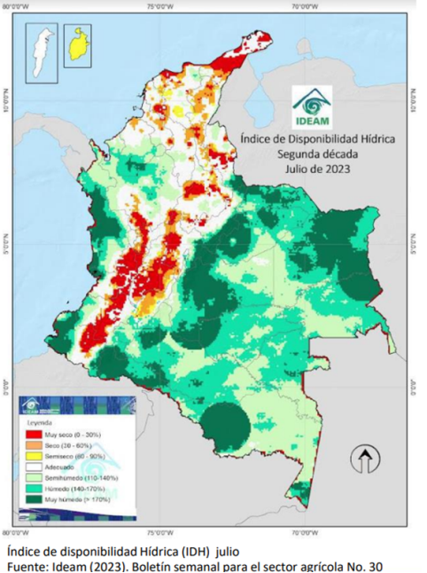

---
output:
  word_document:
    reference_docx: estilos.docx
  pdf_document:
    latex_engine: pdflatex
    keep_tex: yes
    number_sections: yes
  html_document:
    df_print: paged
  classoption: landscape
geometry:
- includeheadfoot
- left=0.60in
- right=0.60in
- top=0.5in
- bottom=1.2in
params:
  month: 7
  year: 2023
  month_b: Noviembre
  trim: II
  fecha_publicacion: 14 de Diciembre de 2022
  directorio: C:/Users/Asus/OneDrive - dane.gov.co/proyecto2/Automatizacion CABYS/Automatizacion/Formato_carpetas
header-includes:
- \usepackage{titling}
- \usepackage{graphicx}
- \usepackage{fancyhdr}
- \usepackage{xcolor}
- \pagestyle{fancy}
- \fancyhead[R]{\includegraphics[width=18cm]{img/Header.png}\\ {\fontfamily{put}\selectfont      \textcolor{gray}{\Large
  `r paste(params$month_b,"de",params$year)`}}}
- \fancyhead[L]{ {\fontfamily{put}\selectfont \textcolor{gray}{\Large `r paste("ISE ",params$month_b," PIB ",params$trim," Trimestre de ",params$year)`}}}
- \setlength{\headheight}{70.83125pt}
- \fancyfoot[R]{\includegraphics[width=18cm]{img/footer.png}\\     \thepage}
- \renewcommand{\footrulewidth}{0pt}
---


`r paste("ISE ",params$month_b," PIB ",params$trim," Trimestre de ",params$year)`

# PRESENTACION DE RESULTADOS Sección A: Agricultura, ganadería, caza, silvicultura y pesca


```{r setup, include=FALSE}
knitr::opts_chunk$set(echo = TRUE)
library(readxl)
library(openxlsx)
library(dplyr)
library(ggplot2)
library(tidyr)
library(scales)
library(lubridate)
library(formattable)
library(plotly)
library(gt)
library(gtExtras)
library(purrr)
library(knitr)
library(tinytex)
library(webshot2)

meses <- c("Ene","Feb","Mar","Abr","May","Jun","Jul","Ago","Sep","Oct","Nov","Dic")
meses_b <- c("Enero","Febrero","Marzo","Abril","Mayo","Junio","Julio","Agosto","Septiembre","Octubre","Noviembre","Diciembre")


```


## Contexto `r paste(meses_b[params$month],"de",params$year)`
\hspace{0.5cm}

### Condiciones Agroclimáticas



El IDH es un indicador agroclimático que permite identificar zonas y periodos con excesos o deficiencias de agua, clasificando las tierras desde muy secas a muy húmedas.

El índice identificó la presencia de tierras húmedas y muy húmedas en:

• Anden del pacifico

• Orinoquía 

• Amazonía

• Norte de Antioquia

• Sur de Córdoba.

Por otro lado, con tierras muy secas, secas y semisecas se identificaron en:

• Oriente de Nariño, Cauca y Valle del Cauca

• Eje cafetero

• Zonas importantes del Huila y del Tolima 

• La Guajira

• Zonas focalizadas en Cundinamarca 
(occidente), Boyacá Santanderes y la región 
Caribe.

Las zonas restantes presentaron un comportamiento adecuado.

**Conclusiones**

• Julio se rigió con probabilidades de ocurrencia del niño altas.

• A pesar de que julio hace parte de la segunda temporada de menos lluvias en la región andina se presentaron lluvias importantes a causa de la transición de sur a norte de la ZCIT, causando influencia de los alisios en el centro del país.

• La Orinoquía presentó lluvias importantes por el comportamiento monomodal característico de la región.

• Se estima que para el mes de agosto los efectos del niño empiecen a notarse generando anomalías por déficit en la región caribe y oriente del país, sin embargo, por las ondas tropicales y la transición de la ZCIT es probable que los efectos del niño debiliten en la región andina.

• Se recomienda activar los planes de prevención ante las crecientes súbitas en alta montaña considerando la influencia de la transición de la ZCIT.

• Se espera que el comportamiento hidrológico de las principales corrientes del país esté dentro de los niveles 
medios, exceptuando las corrientes de la Orinoquia que se espera presenten niveles altos.

• Se recomienda mantener activos los planes de contingencia por posibles ocurrencias de deslizamiento en
zonas inestables.

## Indicadores de precios

```{r}
  carpeta=nombre_carpeta(mes,anio)
  IPP <- read.xlsx(paste0(params$directorio,"/",params$year,"/",carpeta,"/consolidado_ISE/Precios/anex-IPP-",tolower(nombres_siglas[params$month]),params$year,".xlsx"),
                        sheet = "1.1")
  IPC <- read.xlsx(paste0(params$directorio,"/",params$year,"/",carpeta,"/consolidado_ISE/Precios/anex-IPC-",tolower(nombres_siglas[params$month]),params$year,".xlsx"),
                     sheet = "8")

```

\newpage
<!--
\includegraphics[width=18cm]{img/infodane.png}
-->

